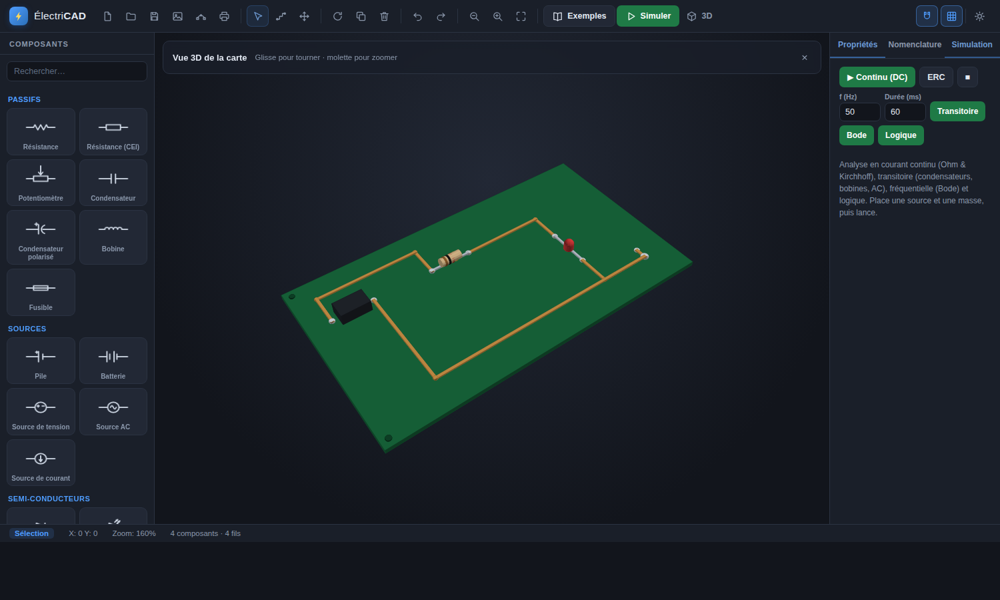
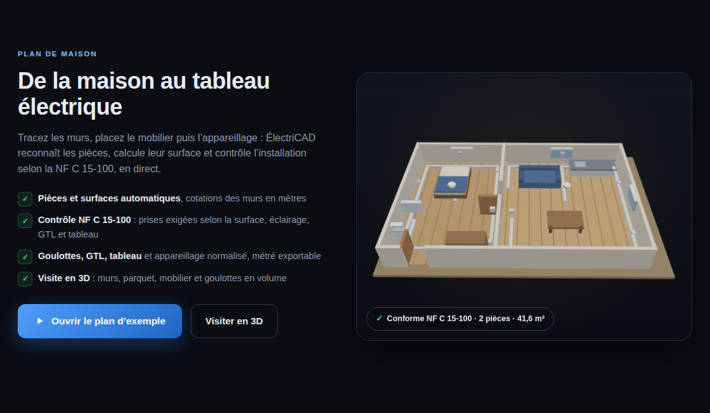

# ⚡ ÉlectriCAD

Une application web de type **AutoCAD** dédiée au dessin de **schémas électriques**.
Aucune installation, aucun serveur : il suffit d'ouvrir `index.html` dans un navigateur.

 



## 🌐 Essayer en ligne

- **Site vitrine** : https://anthonydepollier22-creator.github.io/autocad/
- **Éditeur** : https://anthonydepollier22-creator.github.io/autocad/app.html



Liens directs : `app.html?ex=divider` (charge un exemple : `led`, `lowpass`, `bjt`,
`halfadder`, `maison`…), `&theme=light` force le thème clair, `&3d=1` ouvre la vue 3D,
`&tab=norm` ouvre le rapport NF C 15-100.

## 🧊 Vue 3D

Le bouton **3D** de l'éditeur transforme le schéma en **carte électronique en
relief** : PCB, pistes cuivrées, pastilles et composants volumétriques (résistance
avec anneaux de couleur, dôme de LED, condensateur, transistor, modules DIN…).
Rotation à la souris, zoom à la molette. Le moteur 3D est écrit maison
(`js/viz3d.js`, canvas 2D + algorithme du peintre) — **zéro dépendance**.

## 🇫🇷 Norme française — NF C 15-100

Catégorie « Domestique (NF) » : **disjoncteur** (fermé par défaut, ouvrable au
double-clic), **interrupteur différentiel 30 mA**, **prise 2P+T**, **va-et-vient**
(3 bornes, bascule L1/L2) et **sonnerie** — tous pris en compte par la simulation.
L'exemple **« Tableau électrique (NF C 15-100) »** câble une installation complète
(arrivée 230 V → différentiel → 3 disjoncteurs divisionnaires → circuits) avec
coupure sélective vérifiée par les tests.

## 🏠 Plan de maison & implantation électrique

Dessine une **maison complète** et implante l'installation dedans :

- Outils **Mur** (M) et **Goulotte / chemin de câbles** (G) au tracé orthogonal ;
- **Architecture** : portes (avec débattement), fenêtres — **mobilier** : lit,
  canapé, table, plan de travail avec évier, armoire ;
- **Implantation NF C 15-100** : **GTL**, **tableau électrique**, prises murales
  2P+T, interrupteurs SA / va-et-vient, points lumineux **DCL**, appliques,
  boîtes de dérivation — le tout compté dans la **nomenclature (métré)** ;
- La **vue 3D devient la maison en volume** : murs extrudés, sol parquet,
  goulottes en plinthe, meubles et appareillage 3D ;
- **Pièces et surfaces automatiques** : pose l'étiquette *Pièce* dans une zone
  fermée par les murs (portes et fenêtres comptent comme fermées) → la pièce se
  colore et sa **surface en m²** s'affiche ; une pièce ouverte est signalée
  « non fermée » ;
- **Cotations** : chaque mur porte sa longueur en mètres (100 unités = 1 m), et la
  longueur s'affiche en direct pendant le tracé ;
- **Onglet « Norme »** : contrôle **pièce par pièce** de la NF C 15-100
  (version simplifiée) — prises exigées selon le type et la surface (séjour :
  1 par 4 m², minimum 5 ; chambre : 3 ; cuisine : 6 dont 4 au-dessus du plan de
  travail…), point lumineux et commande, présence de la GTL et du tableau à
  proximité. Pastille verte / orange / rouge sur l'onglet, clic sur une pièce pour
  la cibler ; le type est reconnu d'après le nom (*Séjour*, *Chambre 2*, *SdB*…) ;
- La **vue 3D devient la maison en volume**, avec un **sol par pièce** (parquet
  ou carrelage selon le type) ;
- Exemple fourni : **« Maison T2 — implantation élec. »** (`?ex=maison`, 41 m²,
  conforme), murs/goulottes exclus de la simulation et de l'ERC (aucun faux
  positif). `?ex=maison&tab=norm` ouvre directement le rapport de conformité.


## ⚡ Animation du courant

Après une simulation continue, des **points lumineux circulent le long des fils**
dans le **sens réel du courant**, à une vitesse proportionnelle à son intensité.
La répartition par segment est résolue physiquement (loi des nœuds sur le graphe
des fils, injections aux bornes des composants).

## 🔁 Logique séquentielle

**Bascule D** (déclenchement au front montant, sorties Q et Q̄) et **afficheur
7 segments** (4 bits → chiffre 0-F). Exemples fournis : *Diviseur de fréquence*
(Q à f/2, la brique des compteurs) et *Afficheur 7 segments*.
Le paramètre `&sim=dc|trans|bode|logic` lance l'analyse au chargement.

## ✨ Fonctionnalités

### 🎨 Interface

- **Thème sombre et clair** (bascule en un clic, mémorisé), icônes vectorielles,
  survol des composants, bornes matérialisées en mode câblage.
- **Bibliothèque d'exemples intégrée** : 13 schémas prêts à simuler
  (lampe + interrupteur, diviseur, LED, charge RC, filtre passe-bas, redresseur,
  transistor, demi-additionneur, tableau NF, afficheur 7 segments, diviseur de
  fréquence, compteur, maison T2), avec vignettes, niveaux et type d'analyse.
  Chaque exemple est **validé numériquement par les tests**.
- **Liens partageables** : `?ex=<id>` charge un exemple, `?theme=light|dark` force
  le thème — pratique pour un cours ou un TP.
- **Écran d'accueil** avec raccourcis essentiels sur document vide.


### 🛠️ Éditeur

- **Plan de travail CAO** : grille avec magnétisme (snap), zoom à la molette, panoramique
  (clic milieu ou `Espace` + glisser), ajustement automatique à l'écran.
- **Bibliothèque de symboles** (norme courante) répartis en catégories :
  - *Passifs* : résistance (ANSI & CEI), potentiomètre, condensateur, condensateur polarisé, bobine, fusible
  - *Sources* : pile, batterie, source de tension, source AC, source de courant
  - *Semi-conducteurs* : diode, LED, Zener, transistor NPN / PNP
  - *Sorties* : lampe, moteur, buzzer
  - *Mesures* : voltmètre, ampèremètre, ohmmètre
  - *Commutation* : interrupteur, bouton poussoir, relais
  - *Connexions* : masse, alimentation (VCC), nœud, antenne, transformateur
- **Placement** : clique un symbole dans la palette puis clique sur le plan. Pose en série
  possible. `R` pour pivoter avant ou après placement.
- **Câblage** : outil *Fil* avec routage orthogonal automatique (coude en L) et accroche
  aux bornes des composants. `Maj` inverse le sens du coude.
- **Édition** : sélection simple / multiple (rectangle de sélection), déplacement aimanté,
  rotation, duplication, suppression.
- **Propriétés** : référence automatique (`R1`, `C1`, …) et valeur (`1 kΩ`, `100 µF`, …)
  éditables par composant.
- **Historique** : annuler / refaire illimité (dans la session).
- **Fichiers** : nouveau, ouvrir / enregistrer en `JSON`, export en **PNG** et **SVG**
  vectoriel, **impression / PDF** (avec cartouche projet), glisser-déposer d'un `.json`.

### ⚡ Fonctions « métier » élec

- **Simulation en courant continu — non linéaire** (analyse nodale modifiée +
  **Newton-Raphson** avec limitation de jonction) : calcule les **tensions de nœud**
  et **courants de branche**, affichés sur le schéma (tensions en vert, courants en
  orange). Gère résistances, sources, piles, lampes/moteurs, interrupteurs,
  ampèremètres, **diodes / LED / Zener** (chute ~0,7 V, etc.), bobines (court-circuit)
  et condensateurs (circuit ouvert).
- **Analyse transitoire** (régime temporel, Euler implicite) avec **condensateurs**,
  **bobines** et **sources sinusoïdales (AC)** → **oscilloscope** intégré qui trace
  les tensions de nœud dans le temps (ex. charge RC, redresseur à diode…). Fréquence
  et durée réglables.
- **Transistors bipolaires (BJT)** NPN / PNP en modèle **d'Ebers-Moll** : régimes
  actif, saturé et bloqué (amplification, commutation). Le gain β se règle dans le
  champ *Valeur* (défaut 100).
- **Analyse fréquentielle (Bode)** : MNA en **nombres complexes**, petits signaux
  autour du point de fonctionnement → courbes de **gain (dB)** et de **phase (°)**
  de 1 Hz à 1 MHz (échelle logarithmique). Validé sur filtre RC (−3 dB / −45° à fc).
- **ERC — vérification des règles électriques** : broches non connectées, absence de
  masse / de source, source court-circuitée. Clique un problème pour cibler le
  composant fautif.
- **Électronique numérique** : portes logiques **ET / OU / NON / NON-ET / NON-OU /
  OU-X**, **horloge** (créneau), **entrées** (0/1 basculables au double-clic) et
  **sorties** (indicateurs). Le simulateur logique évalue le réseau dans le temps et
  affiche un **chronogramme** (timing diagram). Les indicateurs de sortie s'allument
  selon leur état.
- **Nomenclature (BOM)** générée automatiquement, regroupée par type/valeur avec
  quantités et références — **export CSV**.
- **Points de jonction** dessinés automatiquement aux connexions (≥ 3 fils ou T).
- **Interrupteurs** ouvrables/fermables (double-clic ou case à cocher) et pris en
  compte par la simulation.
- **Sauvegarde automatique** locale (localStorage) : ton travail est restauré au
  rechargement de la page.
- **Cartouche** : titre et auteur du projet, inclus dans les exports SVG / impression.
- **Recherche** instantanée dans la palette de composants.

## 🚀 Démarrer

```bash
# Option 1 : ouvrir directement
ouvrir index.html dans le navigateur

# Option 2 : petit serveur local (recommandé)
python3 -m http.server 8000
# puis http://localhost:8000
```

## ⌨️ Raccourcis

| Raccourci | Action |
|-----------|--------|
| `Molette` | Zoom avant / arrière |
| `Espace` + glisser / clic milieu | Déplacer la vue |
| `R` | Pivoter (sélection ou aperçu de placement) |
| `Suppr` / `Retour arrière` | Supprimer la sélection |
| `Ctrl + Z` / `Ctrl + Y` | Annuler / Refaire |
| `Ctrl + D` | Dupliquer |
| `Ctrl + A` | Tout sélectionner |
| `Maj` (clic) | Ajouter / retirer de la sélection |
| `Maj` (outil Fil) | Inverser le coude du fil |
| `Double-clic` (outil Fil) | Terminer un fil |
| `Double-clic` (interrupteur) | Ouvrir / fermer l'interrupteur |
| `Échap` | Annuler l'action en cours / outil Sélection |

## 🗂️ Structure du projet

```
.
├── index.html         # Site vitrine (héros 3D, galerie, maison, composants 3D)
├── app.html           # Éditeur (barre d'outils, palette, plan, propriétés)
├── sw.js, manifest.webmanifest  # Application installable (PWA, hors ligne)
├── css/
│   ├── styles.css     # Éditeur — thèmes sombre et clair
│   └── landing.css    # Site vitrine
├── js/
│   ├── symbols.js     # Bibliothèque de symboles (dessin vectoriel)
│   ├── netlist.js     # Connectivité électrique (nets), jonctions, nomenclature
│   ├── plan.js        # Plan de maison : pièces, surfaces, cotations, NF C 15-100
│   ├── simulate.js    # Simulation analogique : DC non-linéaire, transitoire, Bode, ERC
│   ├── digital.js     # Simulation logique (portes, bascules) + chronogramme
│   ├── examples.js    # Bibliothèque d'exemples
│   ├── viz3d.js       # Moteur 3D maison (carte électronique / maison en volume)
│   ├── svg.js         # Export vectoriel SVG
│   ├── editor.js      # Moteur CAO : vue, modèle, outils, historique, rendu
│   ├── ui.js          # Câblage de l'interface et opérations fichier
│   └── landing.js     # Animations du site vitrine
└── tests/
    └── run.js         # Suite de tests (node tests/run.js)
```

## ✅ Tests

```bash
node tests/run.js
```

34 vérifications sans dépendance : valeurs numériques de chaque simulation
(loi d'Ohm, LED, transistor, charge RC, redresseur, −3 dB du filtre, tables de
vérité, compteurs), surfaces et conformité NF C 15-100 du plan de maison (y compris
les cas non conformes), construction 3D de tous les exemples et contenu des
exports SVG. Le déploiement GitHub Pages **exécute ces tests d'abord** : une
régression bloque la mise en ligne.

## 🧱 Format de fichier

Les schémas sont enregistrés en JSON lisible :

```json
{
  "version": 1,
  "components": [
    { "id": "e1", "type": "resistor", "x": 100, "y": 80, "rot": 0, "label": "R1", "value": "1 kΩ" }
  ],
  "wires": [
    { "id": "e2", "points": [{ "x": 60, "y": 80 }, { "x": 140, "y": 80 }] }
  ],
  "counters": { "R": 1 }
}
```

## 🛠️ Ajouter un symbole

Ajoute une entrée dans `js/symbols.js` :

```js
mon_symbole: {
  name: 'Mon composant', category: 'Passifs', prefix: 'X',
  terminals: [{ x: -40, y: 0 }, { x: 40, y: 0 }],
  bbox: { x: -40, y: -12, w: 80, h: 24 },
  draw(ctx) {
    line(ctx, -40, 0, -20, 0);
    // … dessin vectoriel dans le repère local …
    line(ctx, 20, 0, 40, 0);
  },
}
```

Le symbole apparaît automatiquement dans la palette, dans sa catégorie.

## 📄 Licence

MIT — libre d'utilisation, de modification et de distribution.
