# ⚡ ÉlectriCAD

Une application de type **AutoCAD** dédiée au dessin de **schémas électriques**.
Dans le navigateur (rien à installer) ou en **application à télécharger** pour
Windows, macOS, Linux et Android — entièrement hors ligne.

 

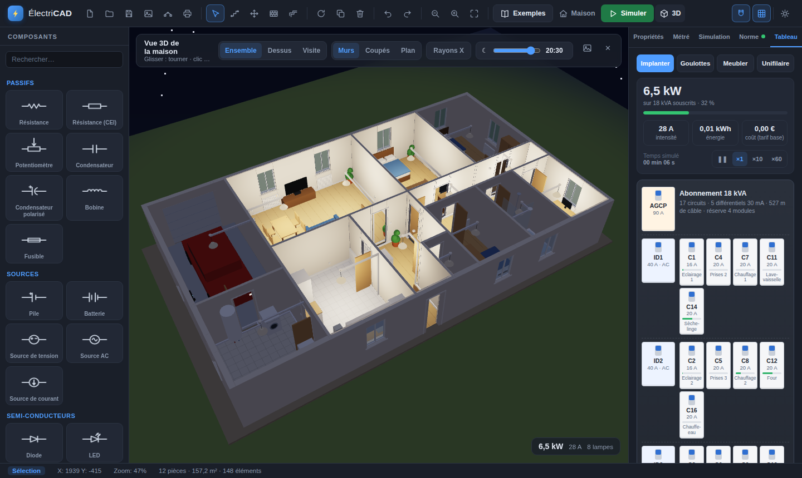

## 🌐 Essayer en ligne

- **Site vitrine** : https://anthonydepollier22-creator.github.io/autocad/
- **Éditeur** : https://anthonydepollier22-creator.github.io/autocad/app.html

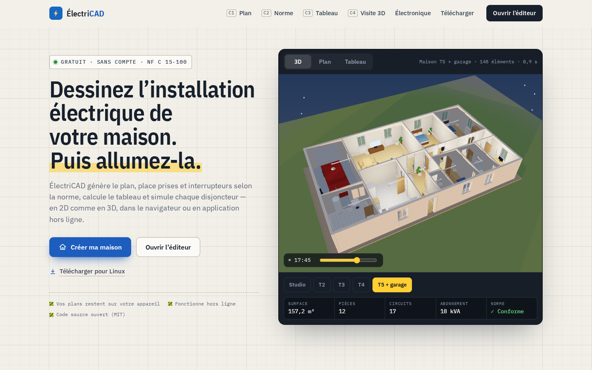

La page d'accueil est elle-même une démonstration : elle génère une maison en direct
(du studio à la maison à étage, dans un *worker*), l'affiche en 3D avec le curseur de l'heure, en plan
ou en tableau, puis détaille le plan annoté, le contrôle NF C 15-100 pièce par pièce
et un **banc d'essai** où l'on surcharge une ligne jusqu'au déclenchement du
disjoncteur (mêmes lois physiques que l'éditeur).

Liens directs : `app.html?ex=divider` (charge un exemple : `led`, `lowpass`, `bjt`,
`halfadder`, `maison`, `maison-t3`, `maison-t5`…), `&theme=light` force le thème clair,
`&3d=1` ouvre la vue 3D, `&tab=norm` le rapport NF C 15-100, `&tab=install` le tableau
simulé, `app.html?houses=1` la fenêtre « Nouvelle maison ».

## 📦 Applications à télécharger

Page de téléchargement : https://anthonydepollier22-creator.github.io/autocad/#telecharger
(elle reconnaît votre système et propose le bon fichier).

| Système | Fichier (dernière version) |
|---|---|
| Windows 10 / 11 | [ElectriCAD-Windows-Setup.exe](https://github.com/anthonydepollier22-creator/autocad/releases/latest/download/ElectriCAD-Windows-Setup.exe) |
| macOS 12+, puce Apple | [ElectriCAD-macOS-arm64.dmg](https://github.com/anthonydepollier22-creator/autocad/releases/latest/download/ElectriCAD-macOS-arm64.dmg) |
| macOS 12+, Intel | [ElectriCAD-macOS-x64.dmg](https://github.com/anthonydepollier22-creator/autocad/releases/latest/download/ElectriCAD-macOS-x64.dmg) |
| Linux 64 bits | [ElectriCAD-Linux.AppImage](https://github.com/anthonydepollier22-creator/autocad/releases/latest/download/ElectriCAD-Linux.AppImage) · [ElectriCAD-Linux.deb](https://github.com/anthonydepollier22-creator/autocad/releases/latest/download/ElectriCAD-Linux.deb) |
| Android 7+ | [ElectriCAD-Android.apk](https://github.com/anthonydepollier22-creator/autocad/releases/latest/download/ElectriCAD-Android.apk) |
| iPhone, iPad, Chromebook | application web : Safari → *Partager* → *Sur l’écran d’accueil* (ou « Installer » dans Chrome / Edge) |

- **Bureau (Electron)** : menus Fichier / Édition / Affichage / Aide, raccourcis
  (`Ctrl+S`, `Ctrl+O`, `F3` pour la 3D…), boîtes « Enregistrer sous » du système,
  impression, une seule fenêtre à la fois, et **« Rechercher une mise à jour »**
  (vérifiée aussi au démarrage).
- **Android (Capacitor)** : l'éditeur s'ouvre directement, en tactile — pincer pour
  zoomer, deux doigts pour déplacer, tiroirs pour la palette et les propriétés,
  joystick pour la visite 3D.
- **Première ouverture** : les applications ne sont pas signées par un certificat
  payant. Windows : *Informations complémentaires* → *Exécuter quand même* ; macOS :
  Réglages Système → Confidentialité et sécurité → *Ouvrir quand même* ; Android :
  autoriser les applications inconnues pour le navigateur.

### Publier une nouvelle version

1. Augmenter `version` dans `desktop/package.json` (par exemple `1.0.0` → `1.1.0`).
2. Pousser : le workflow **Applications à télécharger** (`.github/workflows/apps.yml`)
   lance les tests, construit Windows, macOS (2 puces), Linux et Android sur GitHub
   Actions, puis publie la release `v1.1.0` avec ses 6 fichiers. Les liens
   `releases/latest/download/…` du site pointent aussitôt vers elle.

Il peut aussi être lancé à la main (onglet *Actions* → *Run workflow*) ; avec la même
version, les fichiers de la release existante sont remplacés.

En local :

```bash
cd desktop && npm ci && npm start        # lancer l'application de bureau
cd desktop && npm run dist               # construire l'installateur du système courant
cd mobile && npm ci && npm run web && npx cap add android && npm run icons && npx cap sync
cd mobile/android && ./gradlew assembleDebug   # APK (JDK 21 + SDK Android)
```

L'APK est signé avec `mobile/debug.keystore` (clé de débogage publique, gardée
stable pour que chaque version s'installe par-dessus la précédente) : il convient à
une diffusion directe, pas au Play Store.

## 🏠 Types de maison — générés, meublés, implantés, câblés

Le bouton **Maison** propose six types : **Studio** (29 m²), **Appartement T2**
(48 m²), **Appartement T3** (79 m²), **Maison T4 de plain-pied** (104 m²),
**Maison T5 + garage** (157 m² + garage avec borne de recharge) et **Maison à étage**
(R+1, 156 m² : séjour, cuisine, bureau et escalier en bas, trois chambres et salle de
bains en haut). En un clic :

- **Plan** : murs extérieurs (20 cm) et cloisons (10 cm) déduits des pièces, portes
  ouvrant dans le bon sens (WC vers l'extérieur), fenêtres, porte de garage ;
- **Mobilier** posé par un solveur sans collision : il respecte le débattement des
  portes, les passages, les dégagements devant les meubles et n'installe jamais un
  meuble haut devant une fenêtre (cuisine en L, canapé face à la TV, lit tête au mur,
  douche en angle, voiture garée en marche avant…) ;
- **Implantation NF C 15-100** : GTL et tableau près de l'entrée, point lumineux au
  centre de chaque pièce (deux pour un grand séjour), interrupteur à chaque porte côté
  poignée (va-et-vient s'il y a plusieurs accès), prises réparties le plus uniformément
  possible, 4 au-dessus du plan de travail, de part et d'autre du lit, derrière le
  réfrigérateur, **rien dans le volume 2** d'une douche ou d'une baignoire, RJ45, DAAF,
  VMC, radiateurs sous les fenêtres (~80 W/m²) ;
- **Goulottes** tracées automatiquement : plus courts chemins sur la grille des pièces
  (Dijkstra, pénalité de virage), qui suivent les plinthes, passent les seuils et
  partagent un tronc commun depuis le tableau.

### Maison à étage (R+1)

Les deux niveaux sont dessinés côte à côte sur le plan, reliés par l'escalier
(« bas » au rez-de-chaussée, « haut » à l'étage, avec sa trémie) :

- les goulottes montent par l'escalier : une **montée** en tirets relie les deux plans
  et compte pour sa vraie hauteur (3 m), pas pour l'écart entre les dessins — dans les
  longueurs de câble, les chutes de tension et la liste du matériel ;
- les circuits d'éclairage et de prises sont **séparés par niveau** (aucun circuit ne
  mélange rez-de-chaussée et étage), le chauffage aussi, et nommés en conséquence
  (« Éclairage RDC », « Prises étage 2 », « Chauffage étage 1 »…) ;
- en 3D, l'étage est **posé sur le rez-de-chaussée** (plancher de 2,80 m, dalle, trémie
  ouverte au-dessus de la volée, garde-corps), sous la toiture ; un filtre **Tout /
  RDC / Étage** isole un niveau, et en **Rayons X** les câbles et le courant montent à
  l'étage par la colonne de l'escalier ;
- en **Visite**, on **monte l'escalier** : la hauteur des yeux suit les marches, on
  sort sur le palier (la volée finit contre le mur : on tourne), la mini-carte passe
  au plan de l'étage, et l'on redescend par la trémie ; les lampes de l'étage
  éclairent l'étage jusqu'à son plafond.

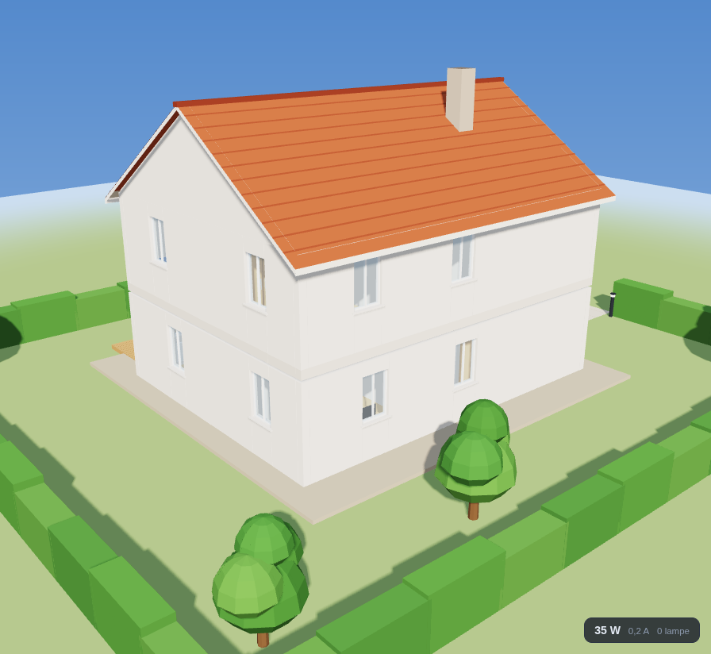

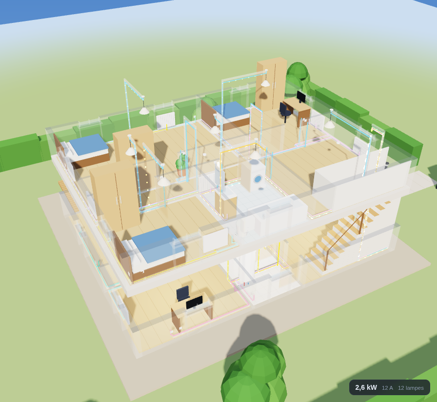

Les mêmes outils marchent sur **votre propre plan** : onglet Tableau → *Implanter*,
*Goulottes*, *Meubler*. Tous les types sortent conformes (0 erreur, 0 avertissement)
et sont vérifiés par les tests.

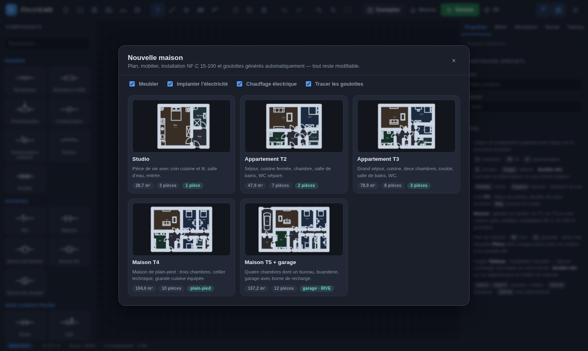

## ⚡ Installation simulée — onglet Tableau

L'installation est **conçue** puis **simulée en temps réel** :

- **Circuits** : éclairage (8 points max, 16 A, 1,5 mm²), prises (8 max, 20 A,
  2,5 mm²), prises cuisine (6 max), chauffage (4 500 W max), circuits spécialisés
  (four, lave-linge, lave-vaisselle, sèche-linge, chauffe-eau, VMC 2 A, plaque 32 A /
  6 mm², borne de recharge 40 A / 10 mm²) ;
- **Différentiels 30 mA** selon la surface (≤ 35 m² : 25 A AC + A ; ≤ 100 m² :
  2 × 40 A AC + A ; au-delà : 3 × AC + A ; type F dédié à la borne), plaque et
  lave-linge sous type A, éclairages répartis sur plusieurs différentiels ;
- **Abonnement** et disjoncteur de branchement d'après la puissance probable ;
- **Câbles tirés dans les goulottes** : longueur de chaque circuit, **chute de
  tension** ΔU = 2·ρ·L·I/S (limite 3 % éclairage, 5 % autres) ;
- **Physique** : charges résistives (P ∝ U²) avec la chute de tension tronçon par
  tronçon, **disjoncteurs courbe C** (échauffement du 1er ordre θ → (I/In)², déclenchement
  à 1,13² : jamais sous 1,13 In, 86 s à 1,6 In), **déclenchement magnétique** quand
  Icc = U / Z<sub>boucle</sub> dépasse 10 In, **différentiel** sur défaut d'isolement,
  **disjoncteur de branchement** au-delà de la puissance souscrite, compteur d'énergie
  et coût. Temps réel, ×10 ou ×60 ;
- **Tableau interactif** : manettes bleues / rouges (déclenché), charge de chaque
  circuit, clic pour couper ou réarmer ; allumer les pièces (va-et-vient compris),
  mettre en marche les appareils, brancher un radiateur d'appoint, provoquer un
  court-circuit ou une fuite — tout est consigné au journal ;
- Le **plan 2D** montre les lampes allumées (halo) et les appareils en marche ; survoler
  un circuit met ses appareils en évidence.

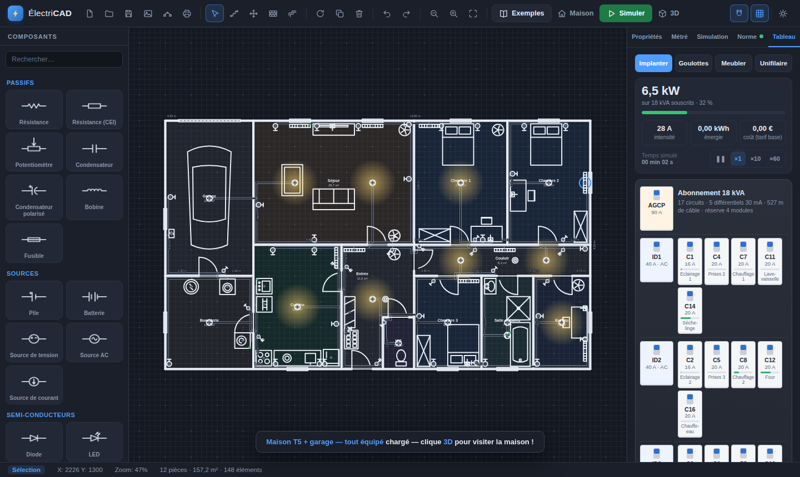

### 🗺️ Plan d'implantation

Le bouton **Repères** (onglet Tableau) affiche à côté de chaque appareil du plan le
**repère de son circuit** (C1, C2…), aux couleurs des câbles de la vue Rayons X ; le
bouton **Câbles** trace le **cheminement de chaque circuit** dans les goulottes jusqu'à
ses appareils (repris par l'export SVG et l'impression, et en folio du dossier technique). Les
exports du plan — **SVG**, **DXF** (calque `CIRCUITS`), **impression** et **dossier** —
deviennent un vrai plan d'implantation : repères de circuits, surfaces des pièces et une
**légende** des symboles électriques avec leurs **quantités**, suivie de la liste des
circuits (repère, désignation, calibre).

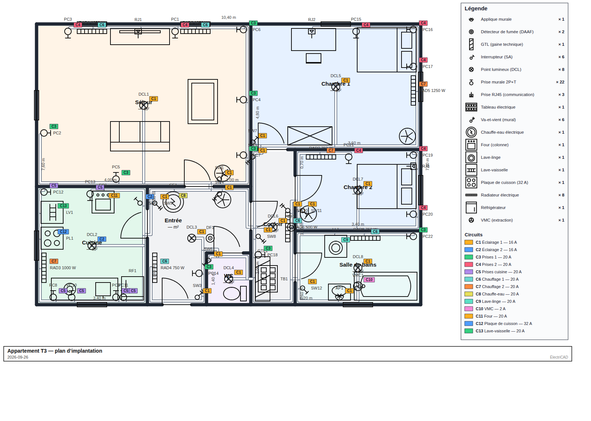

### 🗂️ Tableau électrique et folios (unifilaire, note de calcul, développés, élévations, VDI)

Le bouton **Tableau** (barre d'outils, ou **Folios** dans l'onglet Tableau) ouvre
l'éditeur du tableau, **avec ou sans plan** :

- **Tableau modifiable** : chaque interrupteur différentiel (25 / 40 / 63 A, type AC,
  A, F ou B) et ses circuits — repère, désignation, type, calibre (C2 à C63), section
  (1,5 à 16 mm²), charge (points, prises ou watts), longueur, contacteur heures
  creuses, télérupteur — ordre modifiable, **+ Circuit** d'après 22 circuits types
  (éclairage, prises, cuisine, plaque 32 A / 6 mm², four, lave-linge, chauffe-eau,
  chauffage, VMC, borne IRVE 40 A / 10 mm², volets, PAC…), **+ Différentiel**,
  abonnement, coffret et **parafoudre** ;
- **Monophasé ou triphasé** : en 400 V, disjoncteur de branchement 4P réglé à
  kVA × 5/3 A par phase (6 à 36 kVA), ID 4P, chaque circuit sur L1, L2, L3 ou en
  **3P+N** (borne 11 kW, plaque ou PAC triphasées, câble 5G…), phases **équilibrées**
  automatiquement (modifiables), ΔU des départs triphasés sous 400 V
  (√3·ρ·L·I / S), simulation par phase (la plus chargée fait déclencher l'AGCP) ;
- **Déduit du plan** au départ : la première modification le fige en tableau
  **personnalisé** (les appareils du plan gardent leurs câbles et leurs longueurs ;
  ceux ajoutés ensuite sont signalés puis **répartis** en un clic), annulable avec
  Ctrl+Z, et l'on peut **revenir à l'automatique**. **Sans plan**, un modèle selon la
  surface (chauffage, plaque, IRVE) sert de point de départ — pour tracer l'unifilaire
  d'un logement existant ;
- **Contrôles NF C 15-100 en direct** : calibre protégé par la section (1,5 mm² → 16 A,
  2,5 → 20 A, 6 → 32 A, 10 → 40 A), 8 points d'éclairage, 8 ou 12 socles selon la
  section, 6 en cuisine, 4 500 W de chauffage par circuit, plaque et lave-linge sous
  type A, borne sous type F, 8 circuits par différentiel, nombre d'ID selon la
  surface, circuit sans 30 mA, chute de tension, abonnement, 20 % de réserve ;
- **Folio unifilaire normalisé** (A3 paysage, symboles CEI 60617) : réseau, compteur,
  disjoncteur de branchement 500 mA, parafoudre, borne principale et prise de terre,
  jeu de barres, différentiels, disjoncteurs, contacteurs, désignations verticales,
  **nomenclature** (repère, protection, ID, câble 3G…, longueur, charge, ΔU), légende
  et **cartouche** ; plusieurs folios numérotés si le tableau est grand ;
- **Câblage du tableau** (folio A3) : liaison du disjoncteur de branchement en tête
  de chaque interrupteur différentiel (10, 16 ou 25 mm² selon son réglage), sortie
  de l'ID vers le **peigne** phase / neutre des disjoncteurs, départ de chaque
  circuit (phase, neutre, terre) et **bornier de terre**, conducteurs en couleur ; en
  triphasé, peigne à quatre barres (L1 marron, L2 noir, L3 gris, N bleu), chaque
  circuit sur sa phase et départs 3P+N ;
  le métré ajoute les conducteurs de liaison. Export SVG et DXF ;
- **Note de calcul** (folio A3, méthode conventionnelle du guide UTE C 15-105) : pour
  chaque circuit Ib, protection, câble, **Iz** (méthode B, 2 ou 3 conducteurs chargés),
  longueur jusqu'à l'appareil le plus éloigné, **ΔU**, **Icc mini** en bout de ligne
  (0,8·U0·S / 2ρL), seuil magnétique Im et **longueur maximale protégée** Lmax — un
  éclairage C16 en 1,5 mm² est limité à 37,5 m (l'implantation automatique passe alors
  en C10), une prise C20 en 2,5 mm² à 50 m ; hypothèses (schéma TT, pouvoir de coupure
  3 kA), formules, bilan de puissance et des phases. La **prise de terre** mesurée se
  saisit dans le tableau (100 Ω au plus avec l'AGCP 500 mA). Export SVG, DXF et
  **CSV** (tableur) ;
- **Schémas développés** de l'éclairage (folios A3), pièce par pièce d'après les
  interrupteurs du plan : **simple allumage**, **va-et-vient** (navettes) ou
  **télérupteur** et ses **poussoirs** en parallèle sur la bobine KL dès trois commandes
  (l'implantation automatique pose alors le télérupteur au tableau, le métré compte
  télérupteurs et poussoirs), entre la phase et le neutre, conducteurs en couleur
  (phase, neutre bleu, retour lampe, navettes) ; un schéma type par circuit pour un
  tableau sans plan. Export SVG et DXF (calques SCHEMA / TEXTES / CARTOUCHE) ;
- **Élévations des murs** (folios A3), pièce par pièce : chaque mur vu depuis la
  pièce (nord, est, sud, ouest), portes, fenêtres et plan de travail, chaque appareil
  mural à sa **hauteur de pose** (cotée en cm) et à sa distance de l'angle gauche,
  échelle normalisée 1:50 au plus ; une hauteur hors norme est marquée. Les prises
  de plan de travail posées par l'implantation automatique sont à 1,10 m. Export SVG
  et DXF ;
- **Communication (VDI)** : coffret de communication **grade 2TV** dans la GTL
  (arrivée opérateur et DTIo, box, switch, répartiteur TV, panneau de brassage),
  câblage **en étoile** en catégorie 6 jusqu'à chaque prise RJ45, longueurs mesurées
  sur les goulottes du plan (remontées et lovage compris), lien de 90 m au plus ;
  le métré compte le coffret, le câble et les cordons ; en 3D, les **rayons X**
  montrent ces câbles (turquoise) et le menu des circuits les isole
  (« VDI · Communication »). Export SVG et DXF ;
- **Face avant** du coffret (rangées de 13 modules de 18 mm, réserve, GTL) et
  **étiquettes** de repérage à imprimer à l'échelle 1 ;
- **Dans l'éditeur** : le tableau devient un schéma ordinaire (réseau, compteur, AGCP,
  jeu de barres, ID, disjoncteurs, contacteurs, récepteurs, reliés par des fils) à
  compléter librement avec la palette — nouveaux symboles NF : **AGCP 500 mA**,
  **compteur kWh**, **contacteur**, **télérupteur**, **parafoudre** (manœuvrables et
  simulés comme les disjoncteurs) ; les étiquettes des symboles verticaux passent à
  droite ;
- **Exports** : SVG, **DXF** (en millimètres, calques UNIFILAIRE / TEXTES / CARTOUCHE,
  validé par ezdxf) et **Dossier technique · PDF** : le **dossier technique** A3 — sommaire,
  plan d'implantation (légende, repères de circuits), **plan de câblage** (cheminement
  de chaque circuit dans les goulottes, à sa couleur), unifilaire, câblage, note de calcul, schémas développés, élévations et
  communication, **numérotés à la suite** (folio 3 / 11) — suivi de la face avant et
  des étiquettes A4 — et **Dossier DXF** : tous ces folios côte à côte dans un seul
  fichier pour AutoCAD (millimètres, cartouches numérotés) ; le
  dossier du projet et le métré (coffret, parafoudre, contacteurs, ID 63 A…) suivent.

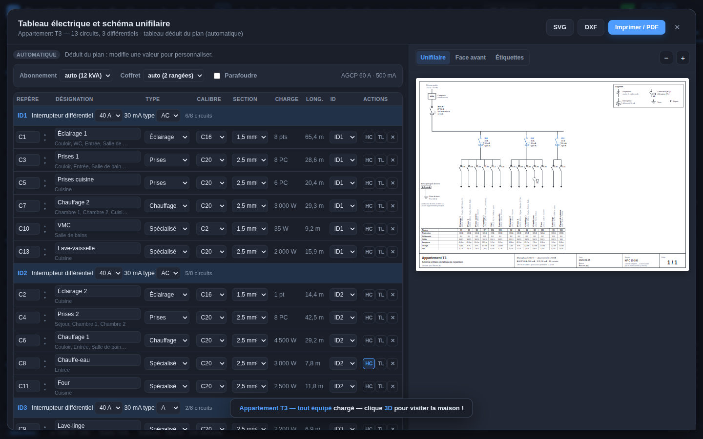

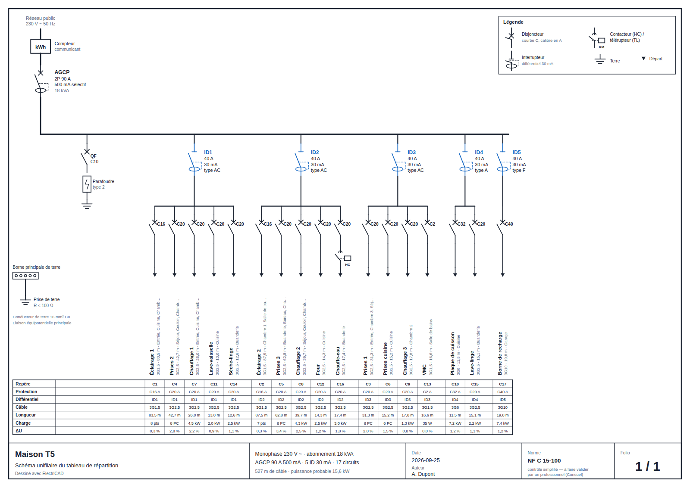

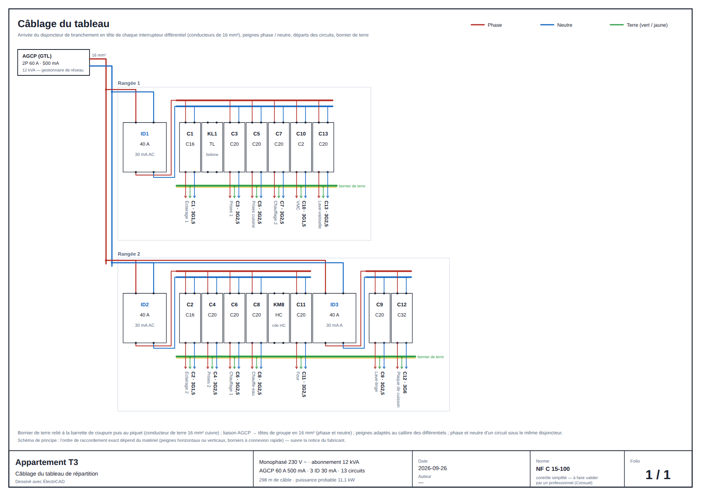

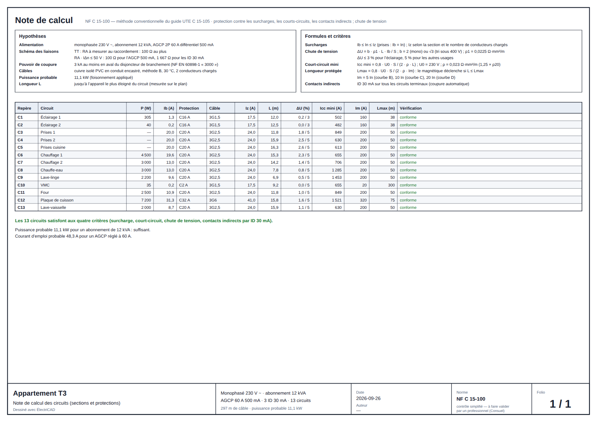

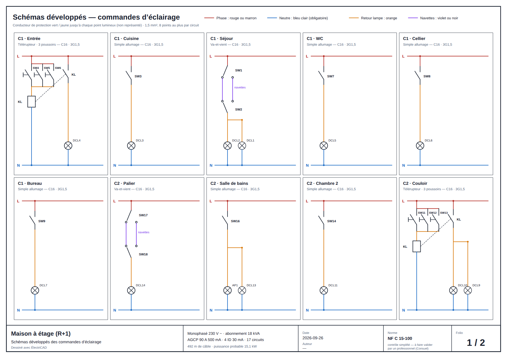

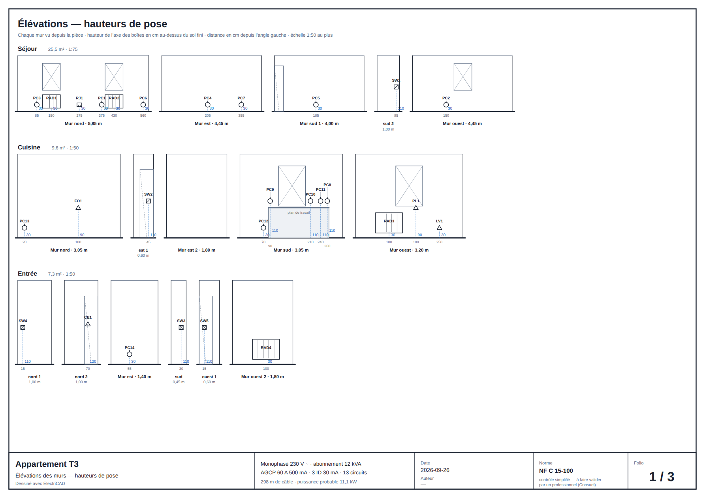

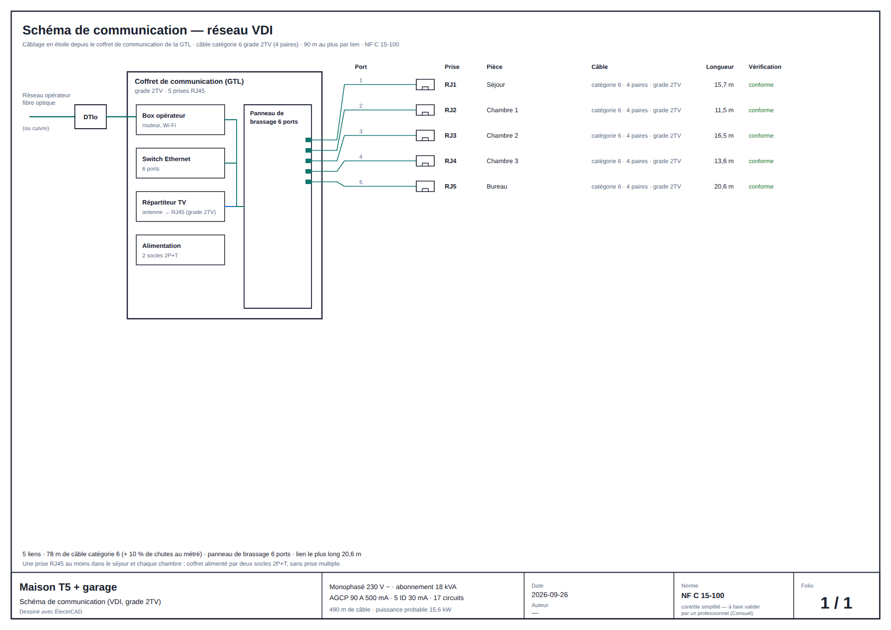

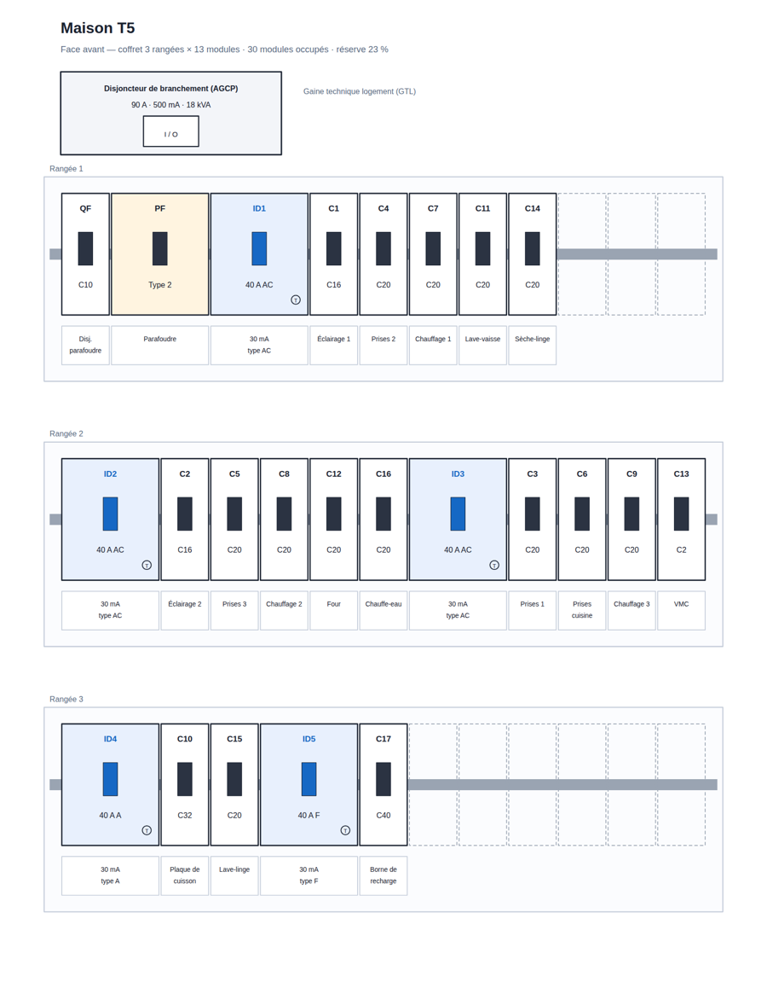

### Dossier du projet — imprimable ou PDF

Le bouton **Dossier** (onglet Tableau) assemble un document A4 prêt à imprimer ou à
enregistrer en PDF : page de garde et chiffres clés, **vues 3D** calculées à la volée
(extérieur, intérieur coupé — pour une maison à étage : extérieur, coupe verticale et
chaque niveau), **plan coté**, **contrôle NF C 15-100** pièce par pièce,
**schéma unifilaire** et tableau des circuits (protection, section, longueur, ΔU,
différentiel), **schémas développés** de l'éclairage, **élévations des murs**, **communication (VDI)**,
**autocontrôle avant la visite du Consuel** (points vérifiés sur le plan et le tableau,
puis liste à contrôler sur place — cochée au fil du chantier dans l'onglet **Norme** et
enregistrée avec le projet), **note de calcul**, **matériel et budget**, **journée type** (graphique, bilan, solaire).

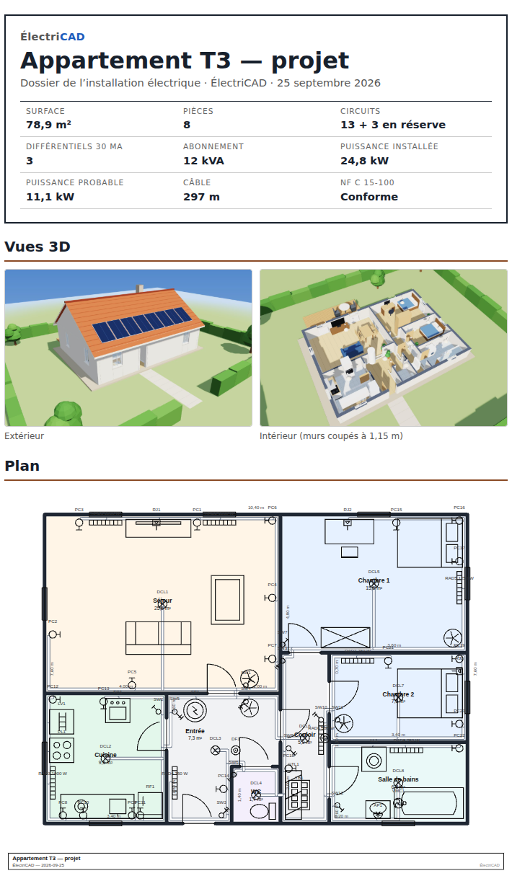

### Panneaux solaires et autoconsommation

Dans la journée type, **Solaire** ajoute 3, 6 ou 9 kWc de panneaux (modules de 400 Wc) :
ils apparaissent **sur le pan sud du toit** en vue 3D Extérieur (le toit limite le nombre
de modules), et la **production heure par heure** se superpose au graphique (≈ 1,5 kWh/kWc
un jour d'hiver dégagé, ≈ 6,5 kWh/kWc en été). Bilan : énergie produite, **autoconsommation**
(part consommée sur place), part des besoins couverte et économie. L'option **« lessive,
vaisselle et chauffe-eau quand le soleil produit »** montre l'intérêt du pilotage : sur un
T3 en été, l'autoconsommation passe d'environ 5 % à 35 %.

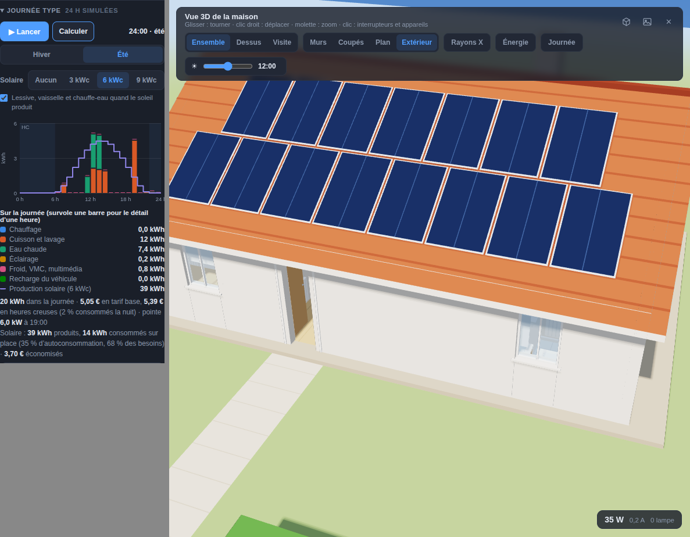

### Matériel et budget — onglet Métré

Dès qu'un tableau est conçu, l'onglet **Métré** chiffre l'installation : coffret (nombre
de rangées de 13 modules, réserve comprise), interrupteurs différentiels par type,
disjoncteurs par calibre, peignes, bornier et prise de terre ; **gaine ICTA préfilée par
section** (longueur réelle des circuits + 10 % de chutes), goulottes, GTL ; prises (dont
spécialisées), interrupteurs simples et va-et-vient, points DCL, RJ45, sorties de câble,
détecteurs de fumée, boîtes d'encastrement ; équipements à part (radiateurs, VMC, borne).
Prix indicatifs TTC, hors main-d'œuvre ; **export CSV** qui s'ouvre directement dans Excel.

### Journée type — 24 heures en 48 secondes

Le bouton **Journée** (onglet Tableau ou barre 3D) fait vivre la maison pendant une
journée d'**hiver** ou d'**été** : réveil à 6 h 30, départ au travail, retour à
17 h 15, dîner, coucher. Les pièces s'éclairent quand il fait nuit, la plaque et le
four tournent aux repas, lessive, vaisselle, **chauffe-eau et recharge de la voiture
en heures creuses**, radiateurs le matin et le soir en hiver. En 3D, **le soleil suit
l'horloge et la saison** — vraie course du soleil à 46° N en heure légale : en hiver,
lever vers 8 h 30, 20,6° au sud à 12 h 45, nuit à 17 h ; en été, lever au nord-est
vers 6 h 15, 67° à 14 h, coucher vers 21 h 45 — et les lampes s'allument d'elles-mêmes ;
le plan 2D aussi.

Le graphique empile l'énergie **heure par heure et par usage** (chauffage, cuisson et
lavage, eau chaude, éclairage, froid et multimédia, recharge), bande des heures creuses
en fond ; survoler une heure en donne le détail. Bilan : kWh de la journée, coût en
tarif base et en heures creuses, part consommée la nuit, **pointe de puissance** comparée
à l'abonnement. « Calculer » donne le résultat immédiatement (pas de 2 min). La
**puissance** appelée par un appareil est sa puissance nominale (pointe, disjoncteurs) ;
l'**énergie** tient compte des thermostats et des cycles (radiateurs, four, plaque,
lave-linge ≈ 1,3 kWh par lessive, lave-vaisselle ≈ 1,5 kWh).

**Bilan annuel** : « Estimer l'année » simule une journée d'hiver (× 212 jours,
octobre → avril) et une d'été (× 153 jours) : consommation par usage (barre empilée),
**facture annuelle et mensuelle abonnement compris** en tarif base et en heures creuses
(la moins chère est signalée), part consommée en heures creuses et, avec des panneaux,
production, autoconsommation, économies et surplus injecté. **Et si l'on rénovait ?** :
pompe à chaleur air/air (chauffage ÷ 3), isolation des combles (−25 % de chauffage),
chauffe-eau thermodynamique (COP 2,5) — kWh et euros économisés par an, prix posé et
temps de retour (ordres de grandeur avant aides). Le bilan et les pistes de rénovation
figurent aussi dans le dossier du projet.

## 🧊 3D temps réel (WebGL2)

Le bouton **3D** ouvre la maison (ou la carte électronique) dans un moteur **WebGL2
écrit maison** — zéro dépendance, avec repli en canvas 2D :

- **Ombres portées du soleil**, ciel et lumière qui suivent l'**heure du jour**
  (curseur : matin, crépuscule, nuit étoilée), brume d'horizon, tone mapping ACES ;
- **Les lampes allumées éclairent leur pièce — et seulement elle** : une texture des
  pièces (issue de la détection du plan) arrête la lumière aux murs ;
- Maison **à l'échelle** : murs de 2,50 m avec allèges et linteaux, **vitrages**
  transparents, huisseries, plafonds, appareillage posé au nu du mur (prises à 30 cm,
  à 1,10 m sur le plan de travail, interrupteurs à 1,10 m), hotte, meubles hauts,
  écrans et plaques qui s'allument, manettes du tableau en 3D ;
- Vues **Ensemble**, **Dessus** et **Visite** : on marche dans la maison à hauteur
  d'yeux (ZQSD / flèches, glisser pour regarder, Maj pour courir) avec **collisions**
  contre les murs et les meubles, mini-carte et pièces éclairées ;
- Murs pleins, **coupés** (1,15 m) ou au sol ; **Rayons X** : murs translucides, câbles
  de chaque circuit (qui rougissent quand ils chauffent) et **courant qui circule**
  du tableau jusqu'aux appareils en marche ; un menu **isole un circuit** : son câble
  s'épaissit, un repère lumineux se dresse sur chacun de ses points et les autres
  circuits s'estompent (calibre, section, longueur, ΔU et pièces desservies affichés) ;
  derrière chaque prise, interrupteur, RJ45 ou applique apparaît sa **boîte
  d'encastrement** : cloison sèche (orange), étanche à l'air dans le doublage (bleu)
  ou maçonnerie (gris), comme au métré ;
  la **prise de terre** apparaît aussi : conducteur vert/jaune du tableau (barrette de
  coupure) à travers le mur jusqu'au piquet enfoncé à 1,50 m sous son regard de visite ;
- **Défaut** : en mode défaut, un clic sur un appareil, une prise ou une lampe y
  provoque un **court-circuit** (gerbe d'étincelles, éclair dans la pièce, le
  disjoncteur du circuit déclenche en magnétique) ou une **fuite à la terre** (le
  différentiel 30 mA coupe tous ses circuits) ; le message donne le courant de défaut
  et la protection qui a agi, **Réparer** supprime les défauts et réarme tout ;
- **Clic** sur un interrupteur, une lampe, un appareil ou une prise : ça bascule ;
  bulle d'information au survol (circuit, section, longueur, tension, puissance) ;
- **Extérieur** : toiture à deux pans en tuiles (33°, faîtage sur le grand côté,
  débords, rives, pignons, cheminée), terrasse en bois et salon de jardin devant le
  séjour, allée jusqu'à la porte d'entrée, entrée de garage, haie et arbres autour du
  terrain, **éclairage extérieur crépusculaire** (applique près de la porte, bornes le
  long de l'allée, qui s'allument à la tombée de la nuit) — les lampes n'éclairent
  jamais le dessous du toit — et, le soir, **les fenêtres des pièces allumées
  rayonnent** d'une lumière chaude vue du dehors ;
- **Soleil** (en vue Extérieur) : la course du soleil d'hiver puis d'été se dessine en
  arc au-dessus de la maison (une perle par heure, midi solaire marqué, le soleil à
  l'heure du curseur), et la lumière suit la vraie position du soleil de la saison —
  on voit pourquoi les panneaux regardent le sud et combien le soleil d'hiver est bas ;
- **Journée** : 24 heures en 48 secondes, le soleil et les lampes suivent l'horloge ;
- **Visite guidée** (en mode Visite) : la caméra parcourt toutes les pièces depuis
  l'entrée, en passant par les portes, et s'arrête dans chacune (nom de la pièce à
  l'écran) — dans une maison à étage, elle finit par monter l'escalier et visiter
  l'étage ; une touche de déplacement rend la main ;
- **Coupe** : un plan vertical tranche la maison, en travers ou en long (bouton ⇄),
  un curseur le déplace d'un bout à l'autre et la caméra se place de profil ; murs et planchers coupés sont remplis
  en gris foncé comme sur une coupe d'architecte — avec la toiture, on obtient une
  maison de poupée, et la maison à étage montre ses deux niveaux l'un sur l'autre ;
- **Énergie** : le sol de chaque pièce se teinte selon la puissance qu'elle consomme
  (échelle 0 → 4 kW), avec une étiquette en watts au-dessus de chaque pièce ;
- **Implanter** (`I`) : poser l'appareillage **directement en 3D** — prise, interrupteur,
  va-et-vient, applique, RJ45 sur le mur visé, à sa hauteur NF (30 cm, 1,10 m, 1,90 m)
  et face à la pièce — ou à la **hauteur choisie** (5 cm, 30 cm, 90 cm et 1,30 m pour
  l'accessibilité PMR, 1,10 m au-dessus d'un plan de travail, 1,90 m) : la 3D, les
  remontées de câble et l'éclairement en tiennent compte, et le contrôle NF signale une
  prise à moins de 5 cm du sol ou une commande hors de 0,90–1,30 m ; point lumineux et
  DAAF au plafond en visant le sol ; **radiateur** dos au mur visé et **bouche VMC**
  au plafond ; « Déplacer » (l'appareil, puis son nouveau mur)
  et « Retirer ». Survoler un appareil affiche sa hauteur : **↑ / ↓** la règle par pas
  de 5 cm, directement en 3D. La hauteur se règle aussi en 2D (panneau Propriétés, *Hauteur de
  pose*) et s'inscrit sur le plan d'implantation (« PC4 h110 »), en SVG et en DXF. Les murs se teintent selon leur **matériau** : **cloison placo
  72/48** (montants de l'ossature tous les 60 cm), carreau de plâtre, brique,
  parpaing, béton, ossature bois, et **doublage placo** côté pièce des façades ; « Mur
  placo / maçonné » change le mur visé, « Doublage » ajoute ou retire celui d'une façade (aussi dans les propriétés d'un mur en 2D, où
  le plan marque les montants de placo tous les 60 cm et hachure la maçonnerie). Le
  métré en déduit les **boîtes d'encastrement** : cloison sèche (placo), **étanches à
  l'air** dans le doublage (RE 2020) ou maçonnerie. Tout reste annulable et le tableau
  se met à jour ;
- **Lumière** (`L`) : carte d'**éclairement** au sol, en lux sur le plan de travail
  (0,85 m), tous les points lumineux allumés — la scène passe à 21 h 30 pour les voir
  briller, puis l'heure revient. Luminaires LED à 60 lm/W ; plafonnier
  lambertien (E = Φ·h²/π·d⁴), applique en demi-espace (E = Φ·h/2π·d³), la lumière
  reste dans sa pièce et les parois en renvoient une part (ρ = 0,5). Chaque pièce
  affiche son éclairement moyen face à l'objectif (100 lx en chambre, 150 au séjour et
  en salle d'eau, 200 en cuisine, 300 au bureau) : ✓ atteint, △ un peu juste,
  ✗ insuffisant. **＋ Appliques** pose ce qui manque, une à une jusqu'à l'objectif —
  au-dessus du plan de travail en cuisine — et l'installation reste conforme ;
- **Vidéo 360°** : un tour complet de caméra (10 s, départ et arrivée en douceur)
  enregistré depuis la vue 3D et téléchargé en `.webm`, prêt à partager ;
- **Export du modèle 3D** en glTF binaire (`.glb`, validé par l'outil officiel Khronos) :
  s'ouvre dans Blender, la visionneuse 3D de Windows, Aperçu, SketchUp ou un moteur de jeu.

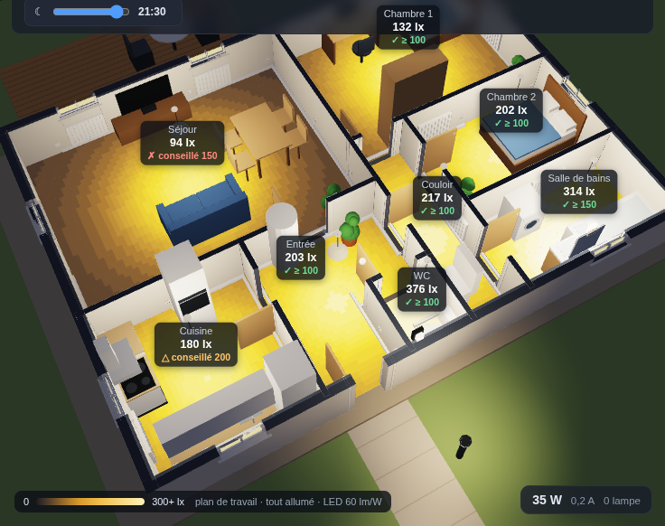

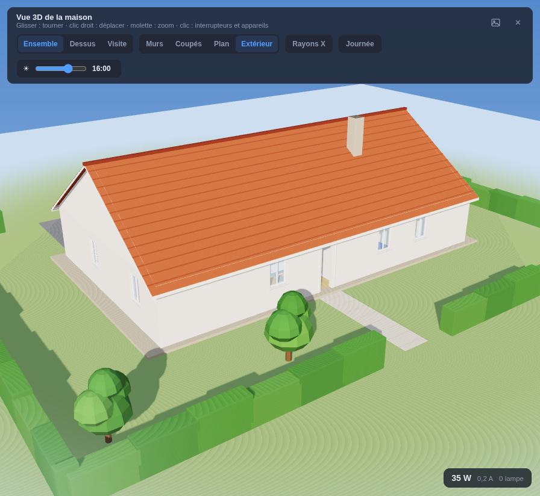

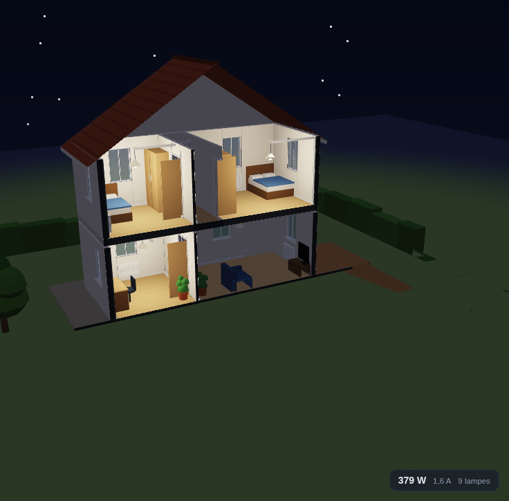

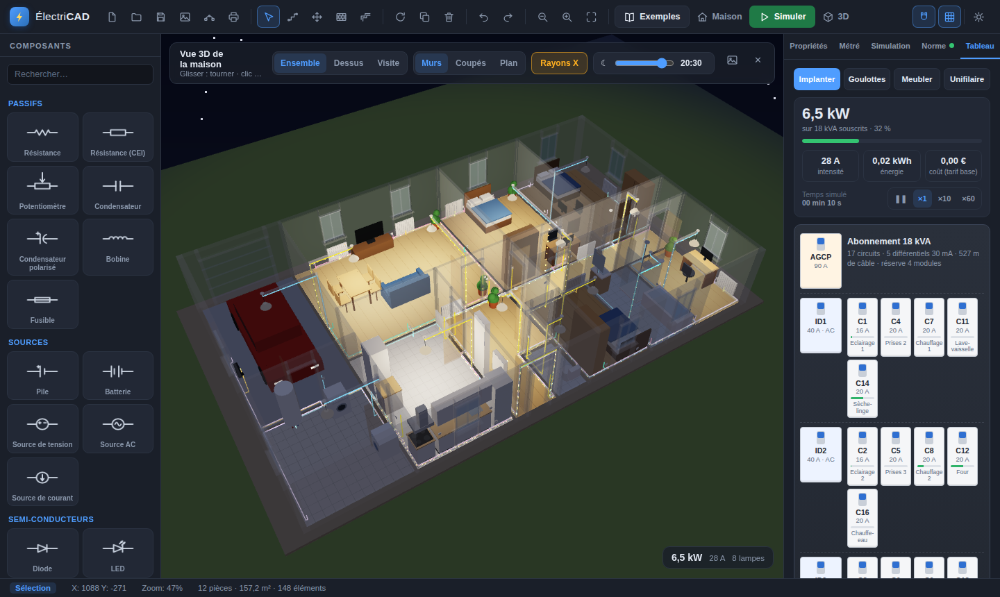

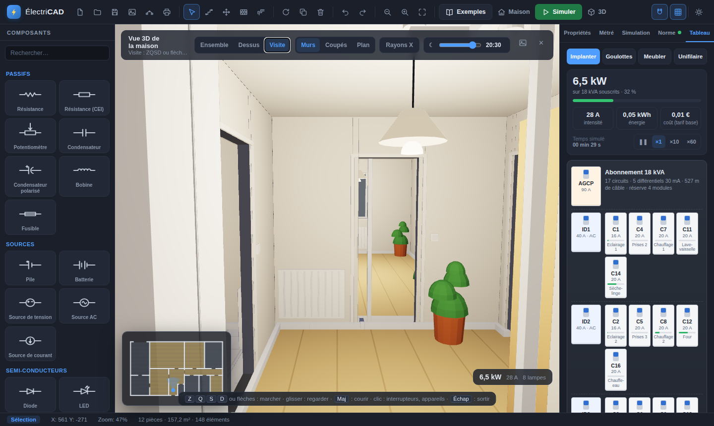

## 🇫🇷 Norme française — NF C 15-100

Catégorie « Domestique (NF) » : **disjoncteur** (fermé par défaut, ouvrable au
double-clic), **interrupteur différentiel 30 mA**, **prise 2P+T**, **va-et-vient**
(3 bornes, bascule L1/L2) et **sonnerie** — tous pris en compte par la simulation.
L'exemple **« Tableau électrique (NF C 15-100) »** câble une installation complète
(arrivée 230 V → différentiel → 3 disjoncteurs divisionnaires → circuits) avec
coupure sélective vérifiée par les tests.

## 🏠 Plan de maison & implantation électrique

Dessine une **maison complète** et implante l'installation dedans :

- Outils **Mur** (M) et **Goulotte / chemin de câbles** (G) au tracé orthogonal
  (double-clic, `Entrée` ou retour au point de départ pour finir) ;
- **Calque** : importe le plan de ta maison (photo ou scan d'un plan d'architecte),
  mets-le à l'échelle en cliquant les deux bouts d'une cote connue et en tapant sa
  longueur, règle son opacité, déplace-le, puis **décalque les murs** : leurs cotes
  sont justes. Le calque reste sous le dessin (il n'est ni exporté ni imprimé) et
  est gardé dans le navigateur d'une séance à l'autre ;
- **Volumes de salle d'eau** : autour de chaque douche et baignoire, le plan teinte le
  volume 1 (l'emprise) et le volume 2 (60 cm autour, arrêté par les murs) — aucune prise
  ni commande n'y est admise, le contrôle Norme le vérifie ; en 3D (Rayons X), le
  volume 1 s'élève jusqu'à 2,25 m et le volume 2 est marqué au sol ;
- **Règle** (L) : glisser d'un point à l'autre affiche la distance en mètres et ses
  écarts horizontal et vertical, aimantée à la grille et aux bornes ;
- **Pièces oubliées** : l'onglet Norme repère les espaces fermés par des murs mais
  sans étiquette *Pièce* (ni surface, ni contrôle) et les étiquette d'un clic, prêts
  à renommer (Chambre, Séjour, Cuisine…) ;
- **Architecture** : portes (avec débattement), fenêtres — **mobilier** : lit,
  canapé, table, plan de travail avec évier, armoire ;
- **Implantation NF C 15-100** : **GTL**, **tableau électrique**, prises murales
  2P+T, interrupteurs SA / va-et-vient, points lumineux **DCL**, appliques,
  boîtes de dérivation — le tout compté dans la **nomenclature (métré)** ;
- **Électroménager et sanitaire** : four, plaque 32 A, réfrigérateur, lave-linge,
  lave-vaisselle, sèche-linge, chauffe-eau, radiateurs, borne de recharge, VMC, douche,
  baignoire, lavabo, WC — **DAAF** et prises **RJ45** ;
- La **vue 3D devient la maison en volume** : murs, un sol par pièce (parquet,
  carrelage ou béton selon le type), goulottes en plinthe et moulures au plafond ;
- **Pièces et surfaces automatiques** : pose l'étiquette *Pièce* dans une zone
  fermée par les murs (portes et fenêtres comptent comme fermées) → la pièce se
  colore et sa **surface en m²** s'affiche ; une pièce ouverte est signalée
  « non fermée » ;
- **Cotations** : chaque mur porte sa longueur en mètres (100 unités = 1 m), et la
  longueur s'affiche en direct pendant le tracé ;
- **Onglet « Norme »** : contrôle **pièce par pièce** de la NF C 15-100
  (version simplifiée) — prises exigées selon le type et la surface (séjour :
  1 par 4 m², minimum 5 ; chambre : 3 ; cuisine : 6 dont **4 au-dessus du plan de
  travail**, vérifiées sur l'emprise du plan de travail ou à 90 cm et plus…), point
  lumineux et commande, GTL et tableau, **détecteur de fumée**, **RJ45** dans les
  pièces principales, **volume 2** des pièces d'eau (60 cm), sortie 32 A de la
  plaque, **hauteurs de pose** (axe des prises à 5 cm au moins, commandes entre
  0,90 et 1,30 m). Pastille verte / orange / rouge sur l'onglet, clic sur une pièce pour
  la cibler ; le type est reconnu d'après le nom (*Séjour*, *Chambre 2*, *SdB*…) ;
- Exemple fourni : **« Maison T2 — implantation élec. »** (`?ex=maison`, 41 m²,
  conforme), murs/goulottes exclus de la simulation et de l'ERC (aucun faux
  positif). `?ex=maison&tab=norm` ouvre directement le rapport de conformité.

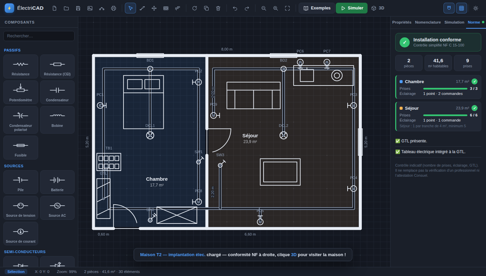

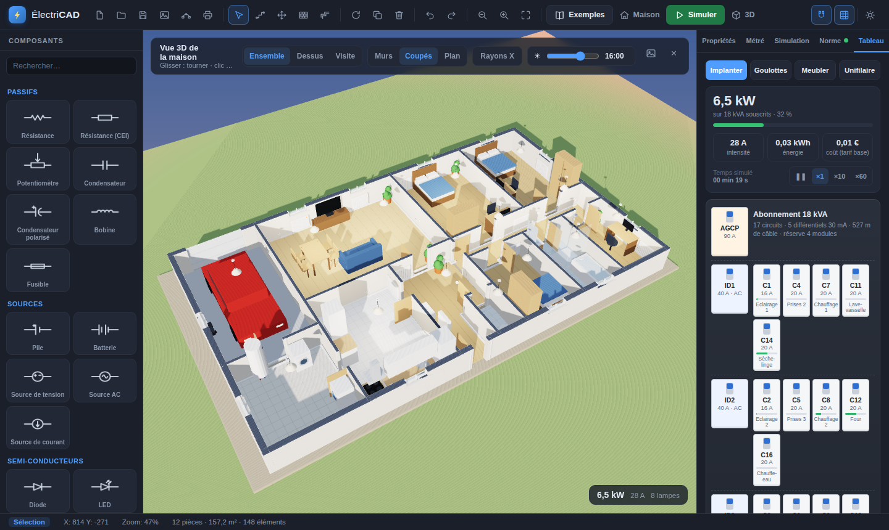

## ⚡ Animation du courant

Après une simulation continue, des **points lumineux circulent le long des fils**
dans le **sens réel du courant**, à une vitesse proportionnelle à son intensité.
La répartition par segment est résolue physiquement (loi des nœuds sur le graphe
des fils, injections aux bornes des composants).

## 🔁 Logique séquentielle

**Bascule D** (déclenchement au front montant, sorties Q et Q̄) et **afficheur
7 segments** (4 bits → chiffre 0-F). Exemples fournis : *Diviseur de fréquence*
(Q à f/2, la brique des compteurs) et *Afficheur 7 segments*.
Le paramètre `&sim=dc|trans|bode|logic` lance l'analyse au chargement.

## ✨ Fonctionnalités

### 🎨 Interface

- **Thème sombre et clair** (bascule en un clic, mémorisé), icônes vectorielles,
  survol des composants, bornes matérialisées en mode câblage.
- **Bibliothèque d'exemples intégrée** : 15 schémas prêts à simuler
  (lampe + interrupteur, diviseur, LED, charge RC, filtre passe-bas, redresseur,
  transistor, demi-additionneur, tableau NF, afficheur 7 segments, diviseur de
  fréquence, compteur, maison T2, appartement T3 et maison T5 tout équipés), avec
  vignettes, niveaux et type d'analyse.
  Chaque exemple est **validé numériquement par les tests**.
- **Liens partageables** : `?ex=<id>` charge un exemple, `?theme=light|dark` force
  le thème — pratique pour un cours ou un TP.
- **Écran d'accueil** avec raccourcis essentiels sur document vide.

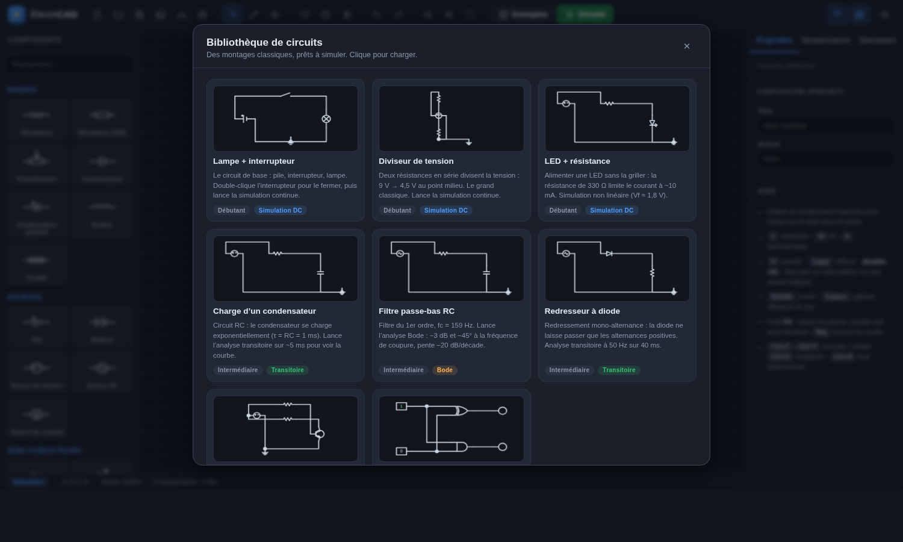

### 📐 Export DXF (AutoCAD)

Le bouton **DXF** exporte le plan au format d'échange d'AutoCAD (R12, ASCII) : il
s'ouvre dans **AutoCAD, LibreCAD, DraftSight, QCAD, FreeCAD**… En **mètres** (Y vers le
haut), avec **un calque par nature d'objet** — `MURS` (polylignes à l'épaisseur réelle :
20 cm en façade, 10 cm en cloison), `MENUISERIES`, `MOBILIER`, `ELECTRICITE`,
`GOULOTTES`, `FILS`, `PIECES` (nom et surface), `REPERES`, `COTES` et `CARTOUCHE` ; les
accents passent en `\U+XXXX`. Les symboles sont dessinés par le même code que l'écran.
Fichier vérifié avec la bibliothèque ezdxf (0 erreur).

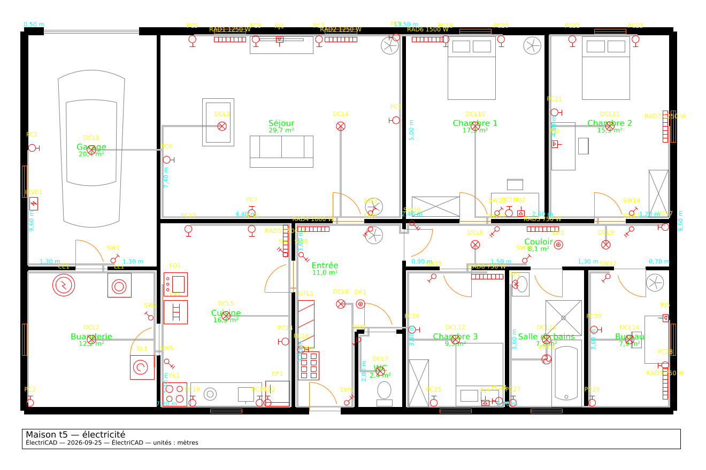

### 📥 Import d'un plan DXF (AutoCAD, LibreCAD, ArchiCAD…)

Le bouton **Ouvrir** (ou un glisser-déposer) accepte aussi un **plan d'architecte en
`.dxf`**. ÉlectriCAD en retrouve la maison :

- **murs en double trait → un mur à son épaisseur** : les faces parallèles (4 à 60 cm)
  sont appariées, les plus proches d'abord, et chaque portion de face ne sert qu'une
  fois (deux cloisons voisines ne fusionnent pas). Un doublage collé au mur est
  absorbé, un trait seul devient une cloison. Les angles et les T sont raccordés à l'axe ;
- **portes et fenêtres** : blocs nommés (`PORTE`, `FENETRE`, `DOOR`, `WINDOW`,
  `GARAGE`…), dessins du calque des menuiseries (un arc de débattement signale une
  porte), et trous dans les murs, recousus avec une ouverture ;
- **façades** : repérées depuis l'extérieur du plan, sinon par l'épaisseur ;
- **noms des pièces** lus dans les textes (`CHAMBRE 1` → « Chambre 1 », surfaces
  écrites ignorées), avec la mise en forme MTEXT et les accents Windows-1252 ;
- **unités** lues dans l'en-tête (`$INSUNITS`), sinon devinées d'après la taille du
  dessin ; blocs insérés développés, cotes, hachures et cartouche ignorés ;
- **maison à étage** : quand la feuille porte plusieurs plans (« REZ-DE-CHAUSSÉE »,
  « ÉTAGE », « R+1 »…, ou deux emprises semblables), ils deviennent des **niveaux**,
  superposés à l'escalier (bloc ou calque `ESCALIER`, sinon au coin du plan) : la 3D
  les empile, l'escalier se monte en visite et les câbles passent par la colonne
  montante. Le [plan d'exemple R+1](samples/plan-exemple-r1.dxf) (étage dessiné sous
  le rez-de-chaussée) redonne ses 12 pièces à ±0,2 m².

Une fenêtre d'aperçu montre le résultat en direct : choix des calques des murs,
unités, surfaces des pièces, avertissements (pièce non fermée, unités douteuses). Un
clic ensuite pour **meubler**, **implanter l'électricité NF C 15-100** et **ouvrir la
3D**. Le [plan d'exemple](samples/plan-exemple-t4.dxf) (un T4 d'architecte en double
trait) redonne les **10 pièces à ±0,2 m²** du plan d'origine ; `app.html?dxf=exemple`
(ou `?dxf=etage`) l'ouvre directement. Le format DWG, fermé, se convertit d'abord en DXF.

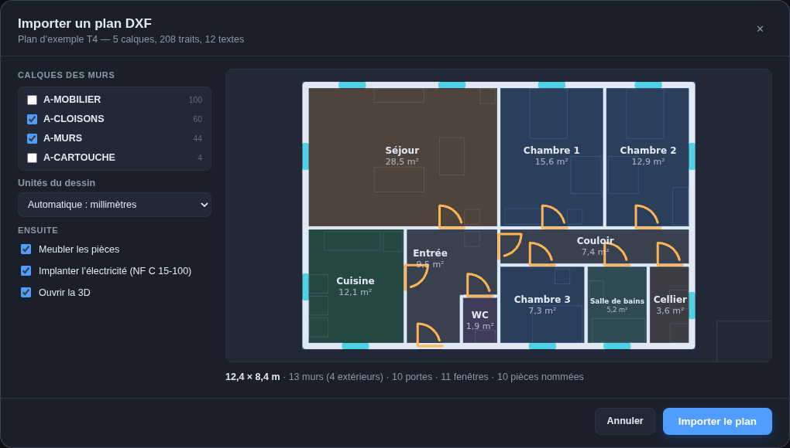

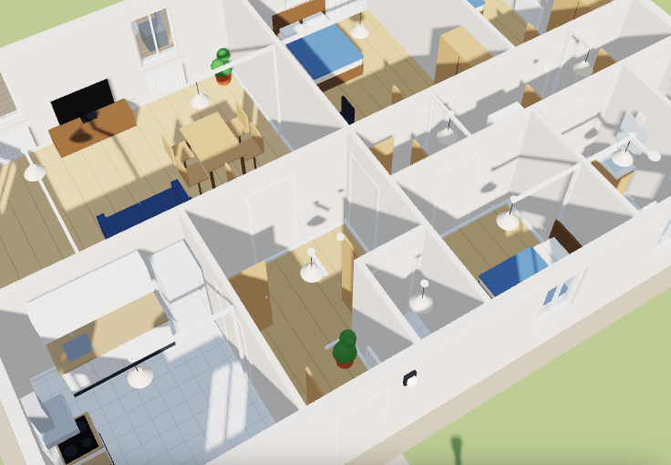

### 🛠️ Éditeur

- **Plan de travail CAO** : grille avec magnétisme (snap), zoom à la molette, panoramique
  (clic milieu ou `Espace` + glisser), ajustement automatique à l'écran.
- **Bibliothèque de symboles** (norme courante) répartis en catégories :
  - *Passifs* : résistance (ANSI & CEI), potentiomètre, condensateur, condensateur polarisé, bobine, fusible
  - *Sources* : pile, batterie, source de tension, source AC, source de courant
  - *Semi-conducteurs* : diode, LED, Zener, transistor NPN / PNP
  - *Sorties* : lampe, moteur, buzzer
  - *Mesures* : voltmètre, ampèremètre, ohmmètre
  - *Commutation* : interrupteur, bouton poussoir, relais
  - *Connexions* : masse, alimentation (VCC), nœud, antenne, transformateur
- **Placement** : clique un symbole dans la palette puis clique sur le plan. Pose en série
  possible. `R` pour pivoter avant ou après placement.
- **Câblage** : outil *Fil* avec routage orthogonal automatique (coude en L) et accroche
  aux bornes des composants. `Maj` inverse le sens du coude.
- **Édition** : sélection simple / multiple (rectangle de sélection), déplacement aimanté,
  rotation, duplication, suppression.
- **Propriétés** : référence automatique (`R1`, `C1`, …) et valeur (`1 kΩ`, `100 µF`, …)
  éditables par composant.
- **Historique** : annuler / refaire illimité (dans la session).
- **Fichiers** : nouveau, ouvrir / enregistrer en `JSON`, export en **PNG** et **SVG**
  vectoriel, **impression / PDF** (avec cartouche projet), glisser-déposer d'un `.json`.

### ⚡ Fonctions « métier » élec

- **Simulation en courant continu — non linéaire** (analyse nodale modifiée +
  **Newton-Raphson** avec limitation de jonction) : calcule les **tensions de nœud**
  et **courants de branche**, affichés sur le schéma (tensions en vert, courants en
  orange). Gère résistances, sources, piles, lampes/moteurs, interrupteurs,
  ampèremètres, **diodes / LED / Zener** (chute ~0,7 V, etc.), bobines (court-circuit)
  et condensateurs (circuit ouvert).
- **Analyse transitoire** (régime temporel, Euler implicite) avec **condensateurs**,
  **bobines** et **sources sinusoïdales (AC)** → **oscilloscope** intégré qui trace
  les tensions de nœud dans le temps (ex. charge RC, redresseur à diode…). Fréquence
  et durée réglables.
- **Transistors bipolaires (BJT)** NPN / PNP en modèle **d'Ebers-Moll** : régimes
  actif, saturé et bloqué (amplification, commutation). Le gain β se règle dans le
  champ *Valeur* (défaut 100).
- **Analyse fréquentielle (Bode)** : MNA en **nombres complexes**, petits signaux
  autour du point de fonctionnement → courbes de **gain (dB)** et de **phase (°)**
  de 1 Hz à 1 MHz (échelle logarithmique). Validé sur filtre RC (−3 dB / −45° à fc).
- **ERC — vérification des règles électriques** : broches non connectées, absence de
  masse / de source, source court-circuitée. Clique un problème pour cibler le
  composant fautif.
- **Électronique numérique** : portes logiques **ET / OU / NON / NON-ET / NON-OU /
  OU-X**, **horloge** (créneau), **entrées** (0/1 basculables au double-clic) et
  **sorties** (indicateurs). Le simulateur logique évalue le réseau dans le temps et
  affiche un **chronogramme** (timing diagram). Les indicateurs de sortie s'allument
  selon leur état.
- **Nomenclature (BOM)** générée automatiquement, regroupée par type/valeur avec
  quantités et références — **export CSV**.
- **Points de jonction** dessinés automatiquement aux connexions (≥ 3 fils ou T).
- **Interrupteurs** ouvrables/fermables (double-clic ou case à cocher) et pris en
  compte par la simulation.
- **Sauvegarde automatique** locale (localStorage) : ton travail est restauré au
  rechargement de la page.
- **Cartouche** : titre et auteur du projet, inclus dans les exports SVG / impression.
- **Recherche** instantanée dans la palette de composants.

## 🚀 Démarrer

```bash
# Option 1 : ouvrir directement
ouvrir index.html dans le navigateur

# Option 2 : petit serveur local (recommandé)
python3 -m http.server 8000
# puis http://localhost:8000
```

## ⌨️ Raccourcis

| Raccourci | Action |
|-----------|--------|
| `Molette` | Zoom avant / arrière |
| `Espace` + glisser / clic milieu | Déplacer la vue |
| `R` | Pivoter (sélection ou aperçu de placement) |
| `Suppr` / `Retour arrière` | Supprimer la sélection |
| `Ctrl + Z` / `Ctrl + Y` | Annuler / Refaire |
| `Ctrl + D` | Dupliquer |
| `Ctrl + A` | Tout sélectionner |
| `Maj` (clic) | Ajouter / retirer de la sélection |
| `Maj` (outil Fil) | Inverser le coude du fil |
| `Double-clic` (outil Fil) | Terminer un fil |
| `Double-clic` (interrupteur) | Ouvrir / fermer l'interrupteur |
| `Double-clic` (appareil du plan) | Mettre en marche / arrêter (four, radiateur, TV…) |
| `Z` `Q` `S` `D` / flèches (vue 3D, Visite) | Marcher dans la maison (`Maj` : courir) ; le nom de la pièce s'affiche en y entrant |
| `1` `2` `3` (vue 3D) | Ensemble / Dessus / Visite |
| `M` (vue 3D) | Murs : pleins → coupés → plan → extérieur |
| `X` `C` `E` `L` `I` `J` `F` (vue 3D) | Rayons X, Coupe, Énergie, Lumière, Implanter, Journée, Défaut |
| `G` `O` `P` `V` (vue 3D) | Visite guidée, course du Soleil, Photo, Vidéo 360° |
| `Entrée` / `Double-clic` (outils Fil, Mur, Goulotte) | Terminer le tracé en cours |
| `L` | Règle : glisser d'un point à l'autre, longueur et écarts en x / y (`Maj` : sans aimantation) |
| `Échap` | Annuler l'action en cours / outil Sélection |

## 🗂️ Structure du projet

```
.
├── index.html         # Site vitrine (démonstration vivante, plan, norme, banc d'essai)
├── app.html           # Éditeur (barre d'outils, palette, plan, propriétés)
├── sw.js, manifest.webmanifest  # Application installable (PWA, hors ligne, raccourcis)
├── screenshots/       # Captures de la fiche d'installation (PWA)
├── fonts/             # IBM Plex Sans / Condensed / Mono (licence OFL), pour le site
├── img/accueil/       # Captures 3D du site vitrine
├── desktop/           # Application de bureau Electron (main.js, icônes, electron-builder)
├── mobile/            # Application Android Capacitor (config, icônes, clé de signature)
├── tools/copy-web.js  # Copie le site dans desktop/www ou mobile/www
├── .github/workflows/ # deploy.yml (GitHub Pages), apps.yml (applications + release)
├── css/
│   ├── styles.css     # Éditeur — thèmes sombre et clair
│   └── landing.css    # Site vitrine
├── js/
│   ├── symbols.js     # Bibliothèque de symboles (dessin vectoriel)
│   ├── netlist.js     # Connectivité électrique (nets), jonctions, nomenclature
│   ├── plan.js        # Plan de maison : pièces, surfaces, cotations, NF C 15-100
│   ├── houses.js      # Types de maison, ameublement, implantation et goulottes automatiques
│   ├── install.js     # Conception du tableau, câbles, chutes de tension, simulation physique
│   ├── board.js       # Tableau : modèle, contrôles NF, unifilaire, note de calcul, schémas développés, face avant, étiquettes
│   ├── vdi.js         # Communication : coffret grade 2TV, câblage en étoile catégorie 6, folio
│   ├── elev.js        # Élévations des murs : faces par pièce, hauteurs de pose cotées, folios
│   ├── board-ui.js    # Éditeur du tableau et du schéma unifilaire
│   ├── day.js         # Journée type : emploi du temps, énergie par heure et par usage
│   ├── materials.js   # Matériel et budget de l'installation, export CSV
│   ├── dossier.js     # Dossier du projet (A4, impression / PDF)
│   ├── simulate.js    # Simulation analogique : DC non-linéaire, transitoire, Bode, ERC
│   ├── digital.js     # Simulation logique (portes, bascules) + chronogramme
│   ├── examples.js    # Bibliothèque d'exemples
│   ├── viz3d.js       # Scène 3D (carte / maison), caméra, visite, repli canvas 2D
│   ├── gl3d.js        # Rendu WebGL2 : ombres, jour/nuit, lampes, vitrages, sélection
│   ├── export3d.js    # Export du modèle 3D en glTF binaire (.glb)
│   ├── svg.js         # Export vectoriel SVG
│   ├── dxf.js         # DXF : export R12 par calques, import de plans d'architecte
│   ├── editor.js      # Moteur CAO : vue, modèle, outils, historique, rendu
│   ├── house-ui.js    # Nouvelle maison, onglet Tableau, contrôle de la vue 3D
│   ├── ui.js          # Câblage de l'interface et opérations fichier
│   ├── house-worker.js # Génération des maisons hors du fil principal (site)
│   └── landing.js     # Site vitrine : démonstration, plan annoté, banc d'essai
├── samples/           # Plans d'architecte d'exemple (DXF : T4, maison à étage)
└── tests/
    ├── run.js         # Suite de tests (node tests/run.js)
    └── fixtures/      # Plans DXF de test (ezdxf : double et triple trait, étage, croquis en mètres)
```

## ✅ Tests

```bash
node tests/run.js
```

179 vérifications sans dépendance : valeurs numériques de chaque simulation
(loi d'Ohm, LED, transistor, charge RC, redresseur, −3 dB du filtre, tables de
vérité, compteurs), surfaces et conformité NF C 15-100 du plan de maison (y compris
les cas non conformes), **les 6 types de maison** (pièces fermées, conformes, mobilier
sans chevauchement, chaque appareil desservi, génération déterministe), **la conception
du tableau** (différentiels selon la surface, 32 A / 6 mm², abonnement), **la physique
calculée à la main** (ΔU = 2·ρ·L·I/S, temps de déclenchement thermique, Icc et
magnétique, différentiel, disjoncteur de branchement, énergie, va-et-vient), la 3D
(lumières par pièce, rayons X, collisions de la visite), **la maison à étage**
(montée de 3 m, circuits par niveau, étage posé à 2,80 m, trémie, filtre par niveau,
montée et descente de l'escalier en visite, visite guidée jusqu'à l'étage), la vue en
coupe, la course du soleil selon la saison, les interactions de l'éditeur 2D (fin d'un
mur au double-clic, à `Entrée` ou en fermant le contour, mise à l'échelle du calque),
**le plan d'implantation** (légende, repères de circuits), **les murs placo / maçonnés** (matériaux, boîtes au métré, montants en 3D), **le tableau et l'unifilaire** (tableau personnalisé identique à l'automatique,
contrôles NF, circuit sans différentiel en simulation, appareils ajoutés puis
répartis, tableau sans plan, triphasé équilibré, face avant, folios, DXF, métré), **l'éclairement** (formule du plafonnier, lumière confinée à sa pièce, appliques
jusqu'à l'objectif), les exports SVG et DXF et **l'import DXF** (aller-retour des 6 maisons, plans
d'architecte produits par ezdxf, maison à étage, croquis en mètres, accents, arcs,
blocs tournés). Le déploiement GitHub Pages **exécute ces tests d'abord** : une
régression bloque la mise en ligne.

## 🧱 Format de fichier

Les schémas sont enregistrés en JSON lisible :

```json
{
  "version": 1,
  "components": [
    { "id": "e1", "type": "resistor", "x": 100, "y": 80, "rot": 0, "label": "R1", "value": "1 kΩ" }
  ],
  "wires": [
    { "id": "e2", "points": [{ "x": 60, "y": 80 }, { "x": 140, "y": 80 }] }
  ],
  "counters": { "R": 1 }
}
```

## 🛠️ Ajouter un symbole

Ajoute une entrée dans `js/symbols.js` :

```js
mon_symbole: {
  name: 'Mon composant', category: 'Passifs', prefix: 'X',
  terminals: [{ x: -40, y: 0 }, { x: 40, y: 0 }],
  bbox: { x: -40, y: -12, w: 80, h: 24 },
  draw(ctx) {
    line(ctx, -40, 0, -20, 0);
    // … dessin vectoriel dans le repère local …
    line(ctx, 20, 0, 40, 0);
  },
}
```

Le symbole apparaît automatiquement dans la palette, dans sa catégorie.

## 📄 Licence

MIT — libre d'utilisation, de modification et de distribution.
